# **La Fraschetta**

[View the live site here](https://la-fraschetta.herokuapp.com/)

This website was built to fulfill the requirements of the Code Institute Milestone 4 Project. It is an e-commerce site designed for the future __La Fraschetta__ store owners, Natasha Buongiorno and Simone Ottaviani.

Using the principles of UX design, this fully responsive website was developed using HTML, CSS, Bootstrap, JavaScript, jQuery, Python, Django, and it uses a SQL database through PostgreSQL, allowing the store owners to easily add, edit or delete the products that they have to sell.

The website payment system uses a service called Stripe. At this stage, the stripe functionality is set up to only accept the test card details. You can find these details [here](https://stripe.com/docs/testing#cards).


## **Contents**

[User Experience (UX)](#user-experience-ux)
* [User Stories](#user-stories)

[Design](#design)
* [Colour Scheme](#colour-scheme)
* [Typography](#typography)
* [Imagery](#imagery)
* [Wireframes](#wireframes)
* [Features](#features)
* [Future Features](#future-features)

[Information Architecture](#information-architecture)
* [Database Design](#database-design)

[Technologies Used](#technologies-used)
* [Languages Used](#languages-used)
* [Site Design](#site-design)
* [Hosting](#hosting)
* [Databases Platform and Cloud Storage](#databases-platform-and-cloud-storage)
* [Frameworks and Libraries](#frameworks-and-libraries)
* [Other Technologies](#other-technologies)
* [Testing](#testing)

[Deployment](#deployment)
* [Requirements for Deployment](#requirements-for-deployment)
* [Initial Deployment](#initial-deployment)
* [How to Fork it](#how-to-fork-it)
* [Making a Local Clone](#making-a-local-clone)

[Testing and Project Barrier Solutions](#testing-and-project-barrier-solutions)

[Credits](#credits)
* [Code](#code)
* [Content](#content)
* [Media](#media)
* [Acknowledgements](#acknowledgements)

---

## **User Experience (UX)**

### User Stories

#### Viewing and Navigation
* As a Shopper:
    * I wish to easily navigate the site so that I can have a good user experience.
    * I wish to get visual feedback so that I see when an action has been completed.
    * I wish to view all the products so that I can choose some to buy.
    * I wish to search for a specific product or category so that I may find the item that I want.
    * I wish to view full product information so that I can see the details of a specific product including the price, description, product rating and product image.
    * I wish to easily see my bag total so that I can stick to my budget.

#### Registration and User Accounts
* As a Site User:
    * I wish to create an account for future purchases so that I can view my order history and confirmations, and save my payment information.
    * I wish to easily login or logout so that I can access my profile and manage my personal details.
    * I wish to be able to request a password reset so that I can receive an email to reset my password incase I forget it.

#### Reviews and Wishlist
* As a Registered User:
    * I wish to be able to add my own reviews to products so that I may share my experience.
    * I wish to be able to add products to my wishlist so that I can view those products later.
    * I wish to be able to remove products from my wishlist so that my wishlist only consists of products I want to have saved.

#### Sorting and Searching
* As a Shopper:
    * I wish to be able to sort the list of available products so that I can sort relevant products alphabetically, by name or by price.
    * I wish to be able to sort a category of products so that I can sort relevant products alphabetically, by name or by price.
    * I wish to be able to search for a specific product by name or description so that I can quickly find items I'm interested in. 
    * I wish to be able to view a list of search results so that I can see if the product I want is available to purchase.
    * I wish to be able to easily see what I've searched for and the number of results so that I can quickly decide whether the product I'm looking for is available.

#### Purchasing and Checkout
* As a Shopper:
    * I wish to buy products online as a guest so that I can checkout without having to create an account.
    * I wish to easily add, update the quantity, or delete products in my bag so that I can adjust my purchase to fit my preferences before checkout.
    * I wish to be able to easily enter my payment information so that I can have a smooth checkout experience.
    * I wish to experience that my payment and personal information are secure so that I can be confident enough to provide the neccessary information to purchase products securely.
    * I wish to view a summary of my order before completing my purchase so that I can check that I havn't made any mistakes.
    * I wish to receive a confirmation email of my purchase so that I can be confident that the purchase has been made successfully and view my order details.

#### Admin and Store Management
* As a Store Owner:
    * I wish to be able to add a new product so that I can add new products to my store.
    * I wish to be able to edit any product so that I can update the details of products.
    * I wish to be able to delete any product so that I can remove old items from my store.

[Back to Top](#la-fraschetta)

---

## **Design**

### Colour Scheme
* The website uses the colours found in the Italian Flag for authenticity.
  * [Colour Palette - Coolers.co](https://coolors.co/0f5520-fffaea-990b16-6c9c79)
  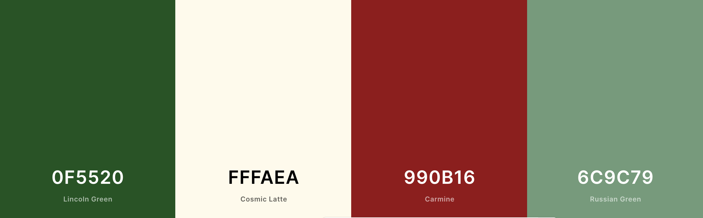

### Typography

* The website uses two fonts from [Google Fonts](https://fonts.google.com/?query=Suwannaphum).
  * The first one is called _Suwannaphum_, chosen for it's traditional (but not rigid) look. It has a fall back font of 'serif'.
  * The second font is called _Dancing Script_, chosen to try incorporate the typical Italian humour and flare. It has a fall back of 'cursive'.

### Imagery

* The icons in the site were taken from font-awesome and used for their obvious meaning.
* The logo was designed and created by Natasha, designer, photographer, and future owner of __La Fraschetta__.
* The first image (on the home page) of the site was chosen as a background for the Title. It is a sunset view of a little town in Tuscany called 'San Giminiano'. This image was chosen as it captures the true essence and beauty of Italy, complete with Italian rooftops, a church, a fort, Vinyards, and hills.
* The images on the _Our Story_ page are all of Natasha and Simone, future owners of __La Fraschetta__, taken by Natasha.
* Some of the product and category images are also photos taken by Natasha. All the rest of the product and category images were chosen from various sites offering royalty-free images, used as placeholders in order to fillful the requirements for this project. These images will eventually be replaced by real __La Fraschetta__ store product images.

### Wireframes
The wireframes for desktop, mobile and tablet for this project can be found below:
* [Home](documentation/wireframes/home.png)
* [Our Story](documentation/wireframes/our_story.png)
* [Contact Us](documentation/wireframes/contact.png)
* [Sign Up](documentation/wireframes/signup.png)
* [Log In](documentation/wireframes/login.png)
* [My Profile](documentation/wireframes/profile.png)
* [Wishlist](documentation/wireframes/wishlist.png)
* [Products and Categories](documentation/wireframes/products_and_categories.png)
* [Product and Reviews](documentation/wireframes/product_and_reviews.png)
* [Shopping Cart](documentation/wireframes/shopping_cart.png)
* [Checkout](documentation/wireframes/checkout.png)
* [Order Success](documentation/wireframes/order_success.png)
* [Add Categories](documentation/wireframes/add_category.png)
* [Add Products](documentation/wireframes/add_product.png)

While the project relied on these wireframes, there are some differences between the wireframes and the final product due to time constraints and change of mind for different/better UI.


## Features

* Home
  * Hero Image
  * List of Categories that lead to the Categorized Products when clicked
  * 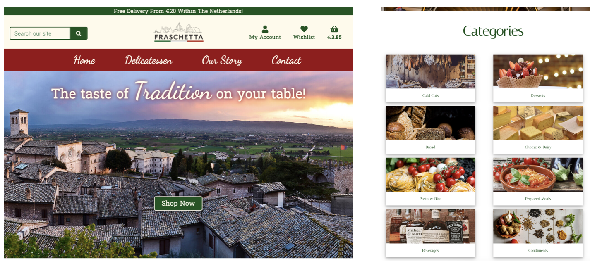

* Navigation Bar
  * 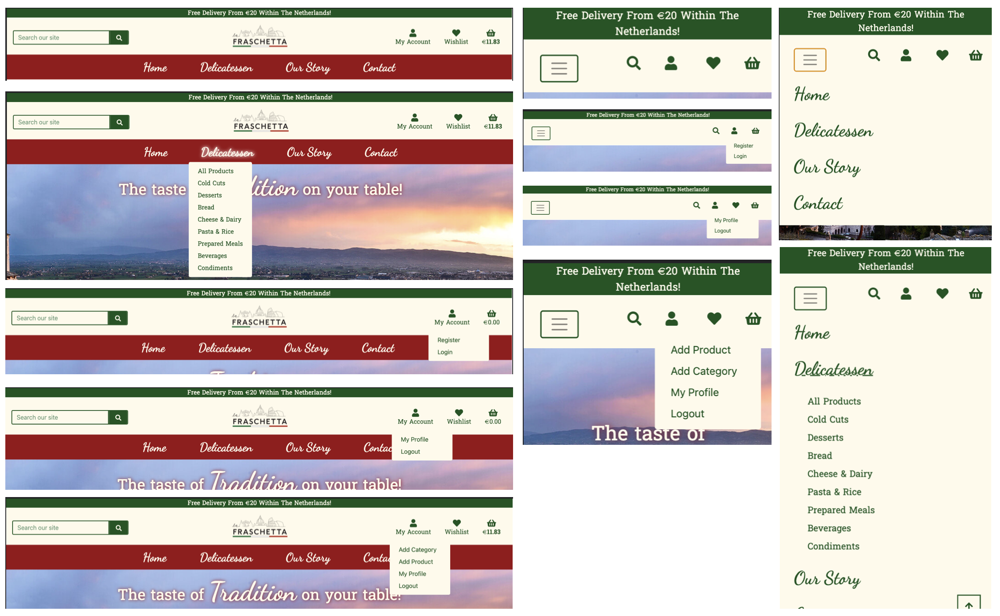

* Footer
  * 

* Our Story
  * Gallery
  * 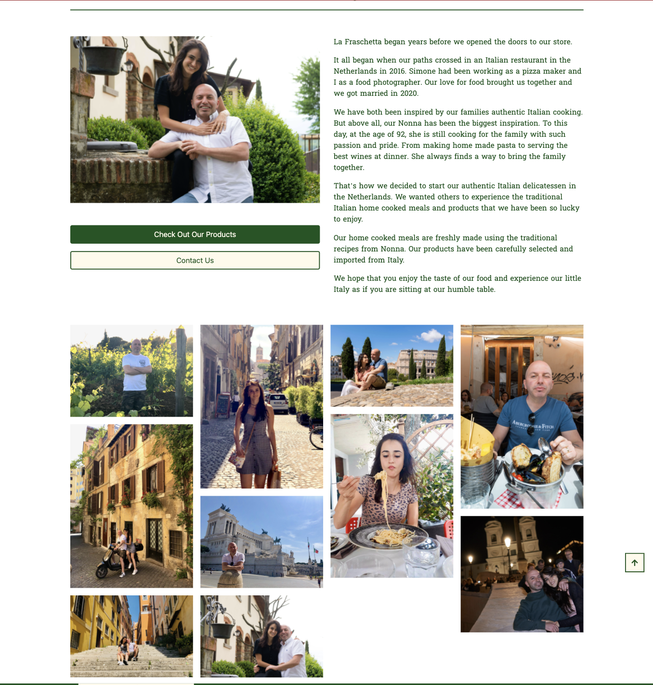

* View a List of Products
  * Sort the List of Products by:
    * _Name_ (A - Z / Z - A)
    * _Category_ (A - Z / Z - A)
    * _Price_ (low - high / high - low)
    * _Ratings_ (low - high / high - low)
    * 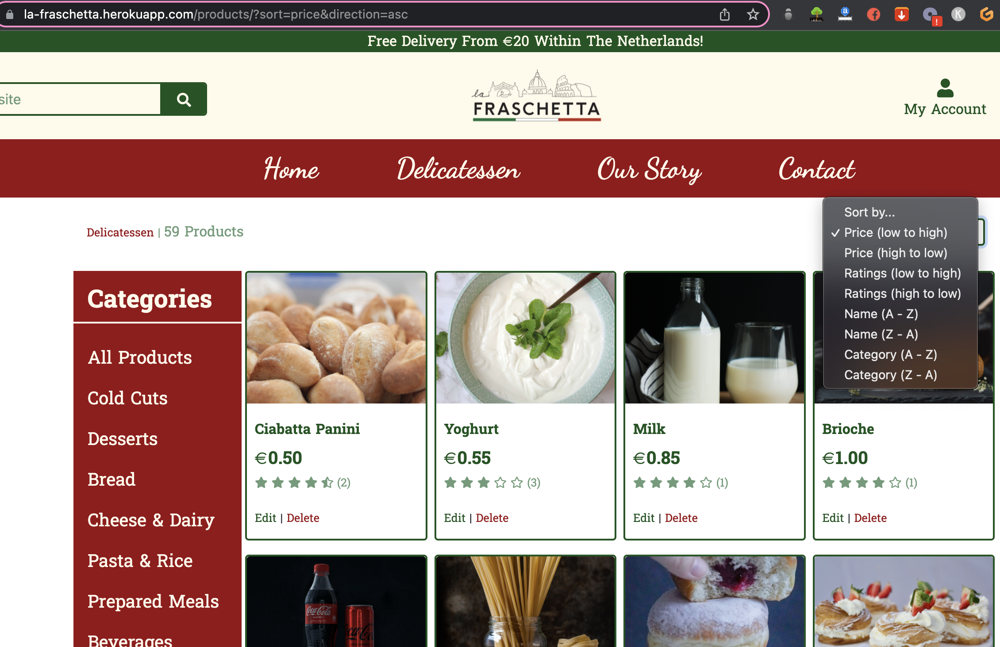

* View a List of Categorized Products
  * Sort the Categorized List of Products by:
    * _Name_ (A - Z / Z - A)
    * _Category_ (A - Z / Z - A)
    * _Price_ (low - high / high - low)
    * _Ratings_ (low - high / high - low)
    * 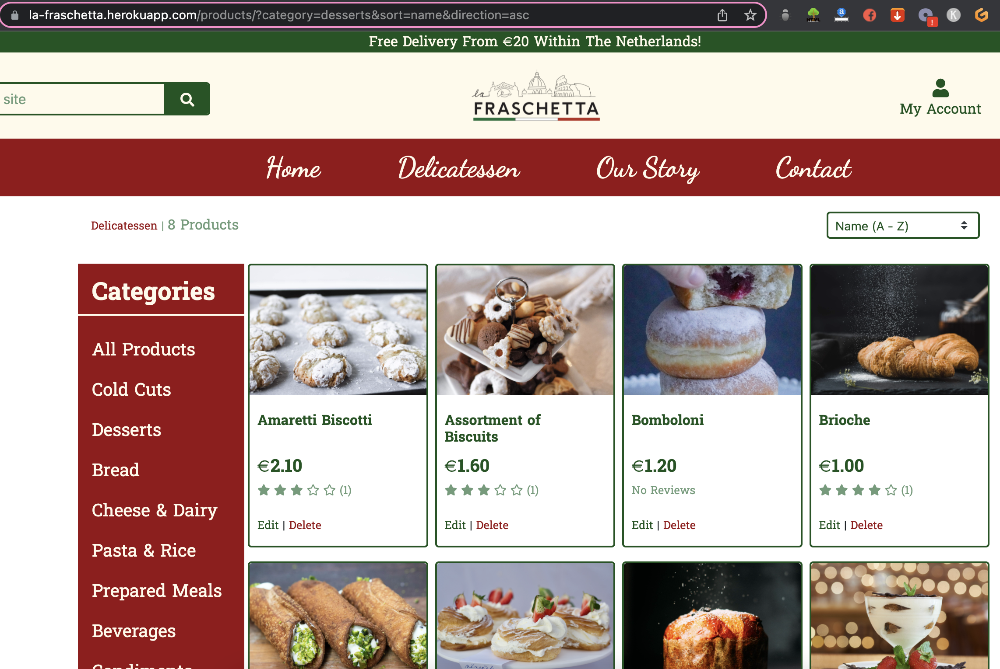

* View the number of ratings and average rating for each product on All Products and Categorized Products page
  * 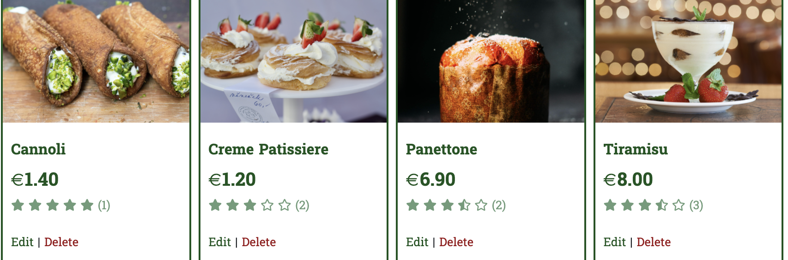

* View Product Details and stock availibility
  * 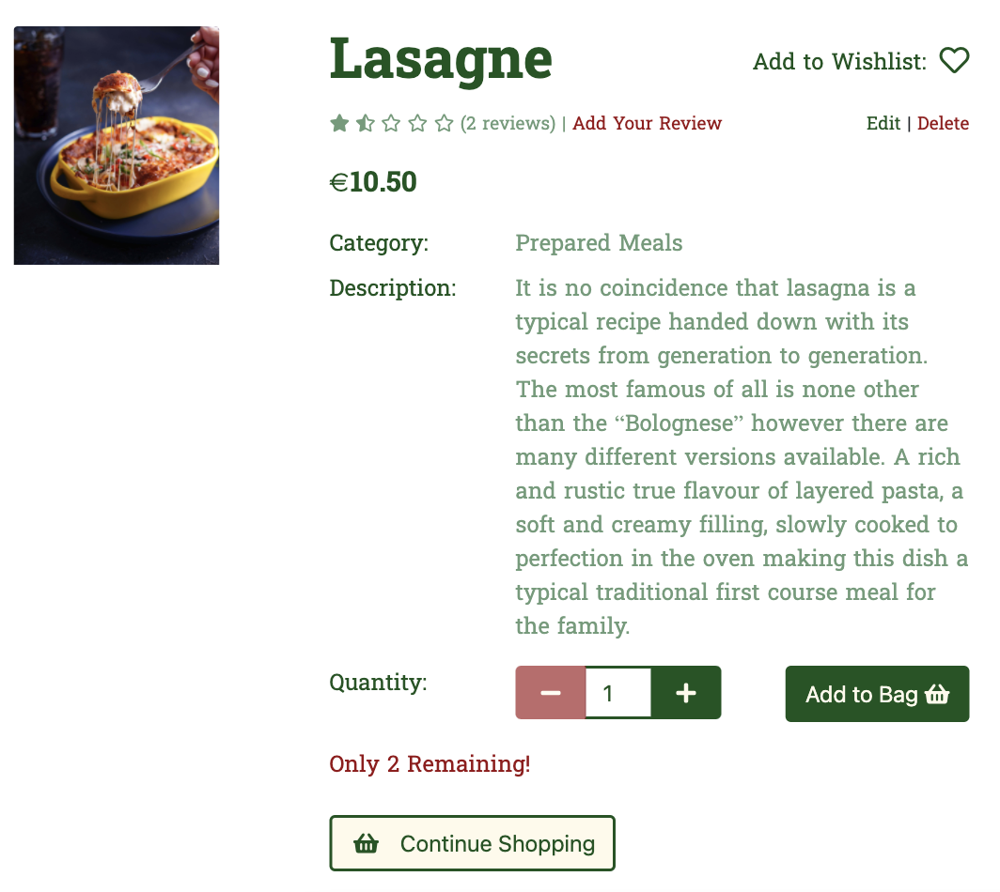

* Add Products to Shopping Cart
* Update quantity and delete Products from Shopping Cart
  * 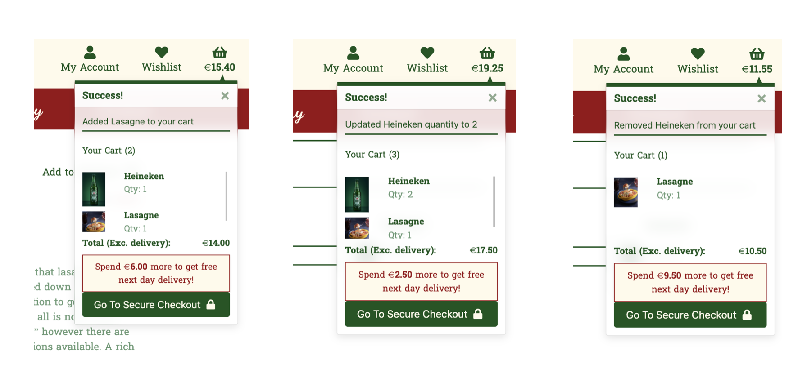

* Make purchases of the products in the Shopping Cart
  * If the payment fails, the user is directed back to the checkout form and is shown a message that the payment failed.
  * If the payment succeeds, the user will be sent a confirmation email containsing the full order details and order number. The user will be redirected to the checkout success page and a message will display, informing the user that the payment succeeded, containing the order details and order number.
  * Ability for a registered user to save their details upon purchase for ease of future purchases
  * 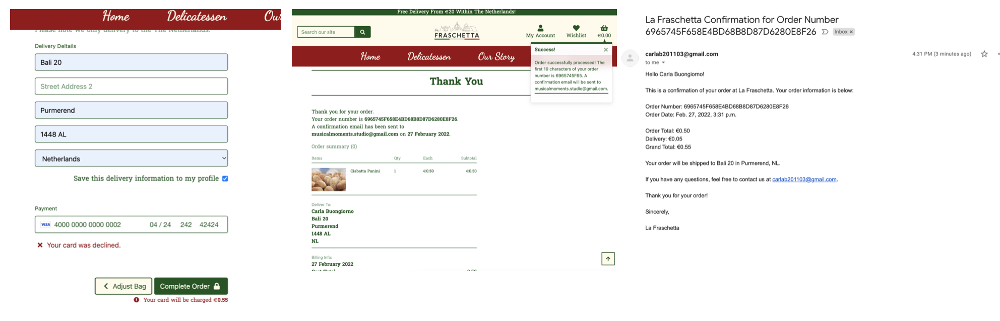

* Profile
  * Update Profile
  * Purchases get saved to a Order History on a registered user's Profile
  * 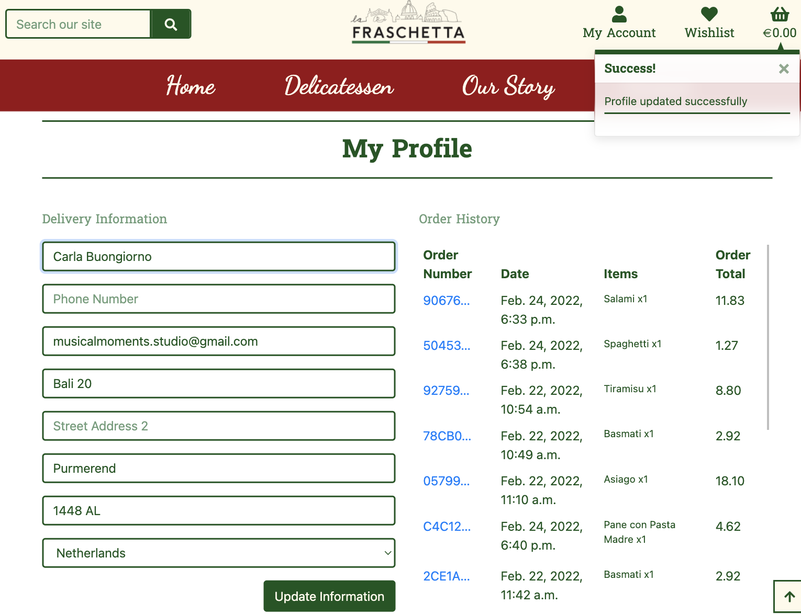

* Register/Sign In
* Sign Out
* Email Verification
  * 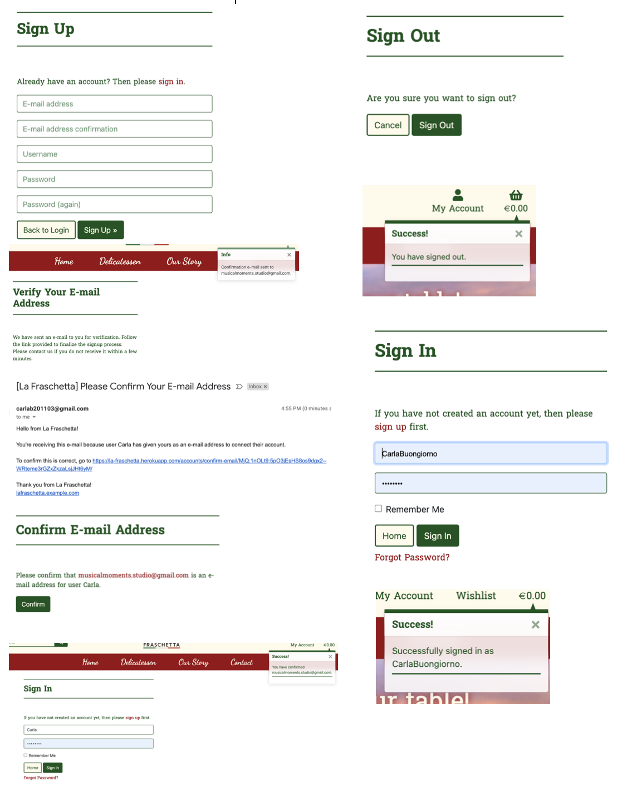

* Wishlist (for the logged in user)
  * Add or remove items from the Wishlist
  * Display wishlisted items with a red heart on All Products (Categorized Products) page
  * 

* Diplay of Reviews with Username and the Date it was added, for each Product 
* Add Reviews (for the logged in user)
  * 

* Store owner has the ability to add Categories
* Store owner has the ability to add / edit and delete Products
  * 

* 404 Page Not Found
* 500 Internal Server Error
  * 

---

### Future Features

* A 'Confirm to delete' modal, allowing the site users to confirm deletion of a product from their shopping cart to avoid accidental deletion.
* The ability for a registered user to delete their account with a 'Confirm to delete' modal.
* The ability for the logged in user to edit and delete their review(s).
* The ability for the logged in user to Add To Wishlist and Remove From Wishlist from the Listed Products page.
* The ability for the store owner to edit and delete Categories.
* A 'Confirm to delete' modal, allowing the store owner to confirm deletion of a product.or category in order to avoid accidental deletion.
* Pagination
* Contact Page

[Back to Top](#la-fraschetta)

---

## **Information Architecture**

### Navigation bar

The navigation bar changes depending on user status and screen size:

| Nav Link | Logged Out | Logged In (User) | Logged In (Admin) |
|-------|-----|-----|-----|
| Logo (small screen) | &#10060; | &#10060; | &#10060; |
| Logo (large screen) | &#9989; | &#9989; | &#9989; |
| Home | &#9989; | &#9989; | &#9989; |
| Delicatessen with dropdown list of Categories | &#9989; | &#9989; | &#9989; |
| Our Story | &#9989; | &#9989; | &#9989; |
| Contact | &#9989; | &#9989; | &#9989; |
| Search Our Site | &#9989; | &#9989; | &#9989; |
| My Account | &#9989; | &#9989; | &#9989; |
| My Account dropdown - Login | &#9989; | &#10060; | &#10060; |
| My Account dropdown - Register | &#9989; | &#10060; | &#10060; |
| My Account dropdown - Profile | &#10060; | &#9989; | &#9989; |
| My Account dropdown - Log Out | &#10060; | &#9989; | &#9989; |
| My Account dropdown - Add Category | &#10060; | &#10060; | &#9989; |
| My Account dropdown - Add Product | &#10060; | &#10060; | &#9989; |
| Wishlist | &#10060; | &#9989; | &#9989; |
| Shopping Basket Icon | &#9989; | &#9989; | &#9989; |

### Database Design
The diagram below illustrates the database structure used in this project.


[Back to Top](#la-fraschetta)

---

## **Technologies Used**

### Languages Used

* [HTML5](https://developer.mozilla.org/en-US/docs/Web/Guide/HTML/HTML5)
* [CSS3](https://developer.mozilla.org/en-US/docs/Archive/CSS3#:~:text=CSS3%20is%20the%20latest%20evolution,flexible%20box%20or%20grid%20layouts.)
* [JavaScript](https://developer.mozilla.org/en-US/docs/Web/JavaScript)
* [Python](https://www.python.org/)

### Site Design

* [Font Awesome](https://fontawesome.com/) was used to add the icons.
* [Coolers.co](https://coolors.co/a71313-3c3cdf-0f0f0f-ffffff-198754-ffca02) was used to generate the colour palette in the readme.
* [Google Fonts](https://fonts.google.com/) was used to import the _Suwannaphum_ and _Dancing Script_ font used within the site.
* [Favicon.io](https://favicon.io/favicon-converter/) was used to generate a favicon for the site using the site's logo.

### Hosting
* [GitHub](https://github.com/) is used to store the code for this project after being pushed from Git.
* [Heroku](https://www.heroku.com) was used to deploy the live site.

### Databases Platform and Cloud Storage
* [SQlite](https://www.sqlite.org/index.html) is the SQL database engine provided by default as part of Django and used during development.
* [Heroku Postgres](https://devcenter.heroku.com/articles/heroku-postgresql) is the SQL database service provided directly by Heroku for storing the site's data.
* [Amazon AWS S3](https://s3.console.aws.amazon.com/s3) was used to host this project's images and static files.

### Frameworks and Libraries 

* [Django](https://www.djangoproject.com/) was used as a Python web framework for its rapid development and clean, pragmatic design
* [pip](https://pip.pypa.io/en/stable/) was used to install the required dependencies for this site.
* [Django-countries](https://pypi.org/project/django-countries/) was used for its pre-built country field containing all the valid country codes.
* [Crispy forms](https://django-crispy-forms.readthedocs.io/en/latest/) was used to manage rendering behaviour and layout of Django forms.
* [Gunicorn](https://gunicorn.org/) was used for WSGI HTTP Server to support deployment of Django application.
* [Jinja](https://jinja.palletsprojects.com/en/3.0.x/) was used to auto-populate the site with the contents of the database.
* [Stripe.js](https://stripe.com/docs/js) library was used for handling Stripe payment objects.
* [Bootstrap](https://getbootstrap.com/) was used to create a beautiful, responsive website.
* [jQuery](https://jquery.com/) was used to make the DOM traversal easier within the JavaScript.

### Other Technologies

* [Git](https://git-scm.com/) was used for version control by utilizing the Gitpod terminal to add and commit to Git and push to GitHub.
* [drawSQL](https://drawsql.app/) was used to design the schema of the relational database.
* [Balsamiq](https://balsamiq.com/) was used to create the wireframes during the design process.
* [Am I Responsive Design](http://ami.responsivedesign.is/) was used for the screenshot in this repository's README.md and TESTING.md.
* [Google DevTools](https://developer.chrome.com/docs/devtools/) was used to check site responsiveness, and as a general debugger.
* [Lighthouse](https://developers.google.com/web/tools/lighthouse/) was used to check the site's Performance, Accessibility, Best Practices, and SEO.
* [Tinyjpg.com](https://tinyjpg.com/) was used to compress the images.
* [Gitpod](https://gitpod.io/) was used as a virtual IDE workspace to build this site.

### Testing

* [W3C Markup Validation Service](https://validator.w3.org/) was used to test that the HTML is valid.
* [W3C CSS Validation Service](http://jigsaw.w3.org/css-validator/) was used to test that the CSS is valid.
* [JSHint](https://jshint.com/) was used to test that the JavaScript is valid.
* [PEP8](http://pep8online.com/) was used to validate the python syntax.


[Back to Top](#la-fraschetta)

---

## **Deployment**

### Requirements for Deployment

* An IDE (such as GitPod or VSCode)
* Git, for version control
* GitHub account
* Python3
* pip, for Python package installation
* Heroku account
* AWS S3 account
* Stripe account
* Email account

#### This project was deployed in two stages:
### 1. Initial Deployment 
_Create a Heroku app, connect to Postgres database and deploy the app without static files._

* Gitpod Local environment
  | KEY         | VALUE |
  | ----------- | ----------- |
  | DEVELOPMENT | True |
    
* Create an env.py file in gitpod

    ```
  import os

  os.environ["SECRET_KEY"] = "#YOUR_SECRET_KEY#"
  os.environ["STRIPE_PUBLIC_KEY"] = "#YOUR_STRIPE_PUBLIC_KEY#"
  os.environ["STRIPE_SECRET_KEY"] = "#YOUR_STRIPE_SECRET_KEY#"
  os.environ["DATABASE_URL"] = "#YOUR_DATABASE_URL#"
  os.environ["STRIPE_WH_SECRET"] = "#YOUR_STRIPE_WH_SECRET#"
  os.environ["AWS_SECRET_ACCESS_KEY"] = "#YOUR_AWS_SECRET_ACCESS_KEY#"
  os.environ["AWS_ACCESS_KEY_ID"] = "#YOUR_AWS_ACCESS_KEY_ID#"
  os.environ["USE_AWS"] = True
  os.environ["EMAIL_HOST_PASS"] = "#YOUR_EMAIL_APP_PASS_CODE#"
  os.environ["EMAIL_HOST_USER"] = "#YOUR_EMAIL_ADDRESS#"
  ```

* To deploy this application on Heroku, Heroku needs to understand what dependencies are required, as well as which files to run for this project.
  * Create a requirements file: in the terminal type the following command:
    * `pip3 freeze --local > requirements.txt`
    * This file will hold a list of all dependencies required for this project.
  * Create a procfile: in the terminal type the following command:
    * `echo web: python run.py > Procfile` 
    * Make sure there is no blank line after the contents of this file.
* Commit and push these changes to GitHub.
* Login or sign up to [Heroku](https://www.heroku.com).
* Select '**Create New App**' in the top right of your dashboard.
* Choose a unique app name, and select the region closest to you, then click '**Create App**'.
* Go to the '**Deploy**' tab, find '**Deployment Method**', and select '**GitHub**'.
* Find your GitHub repository, and click '**Connect**'.
* Navigate to the '**Settings**' tab and click '**Reveal Config Vars**'.
* Enter key-value pairs that match those in your project files for the keys below:
  | KEY                   | VALUE                   |
  | --------------------- | ----------------------- |
    SECRET_KEY            | YOUR_SECRET_KEY
    STRIPE_PUBLIC_KEY     | YOUR_STRIPE_PUBLIC_KEY
    STRIPE_SECRET_KEY     | YOUR_STRIPE_SECRET_KEY
    DATABASE_URL          | YOUR_DATABASE_URL
    STRIPE_WH_SECRET      | YOUR_STRIPE_WH_SECRET
    AWS_SECRET_ACCESS_KEY | YOUR_AWS_SECRET_ACCESS_KEY
    AWS_ACCESS_KEY_ID     | YOUR_AWS_ACCESS_KEY_ID
    USE_AWS               | YOUR_USE_AWS
    EMAIL_HOST_PASS       | YOUR_EMAIL_HOST_PASS
    EMAIL_HOST_USER       | YOUR_EMAIL_HOST_USER
    DISABLE_COLLECTSTATIC | 1 (Add this variable temporarily)

* In Heroku, navigate to the '**Resources**' tab, and add on '**Heroku Postgres**' with the free plan.
* Back up your current sqlite database:
  * As this database was designed without fixtures, make sure manage.py file is connected to mysql database.
  * Backup the current database for each of desired model and load it into a db.json file: in the terminal type the following command:
  `python3 manage.py dumpdata your_model_name > db.json`
  * Repeat this action for each model you wish to transfer to the postgres database (alternatively you can backup your whole database)
* Load data from db.json file into postgres:
  * Create a temporary variable in your environement named: DATABASE_URL with the value of the Postgres URL from Heroku
  * Install the following packages and freeze the requirements: in the terminal type the following commands:
    * `pip3 install dj_database_url`
    * `pip3 install psycopg2-binary`
    * `pip3 freeze > requirements.txt`
  * In la-fraschetta > settings.py, add `import dj_database_url` at top of the page
  * Connect your manage.py file to your postgres database  
    ```
    DATABASES = {
    'default':  dj_database_url.parse('DATABASE_URL')
    }
    ```
* Load your data from the db.json file into postgres: in the terminal type the following command:
  * `python3 manage.py loaddata <your_file>.json`
  * (if you have backed up several json files, repeat this action for each file)
* Make migrations to start using PostgreSQL: in the terminal type the following commands:
  * `python3 manage.py makemigrations`
  * `python3 manage.py migrate`
* Create a superuser to access the Django admin panel: in the terminal type the following command:
  * `python3 manage.py createsuperuser`
  * then add a username and password in the terminal
* Install the Heroku CLI and login: in the terminal type the following command:
  * `heroku login` or `heroku login -i`
* Remove `DISABLE_COLLECTSTATIC = 1` from your heroku config vars.
* Commit and push changes to GitHub.
* Add the hostname of your Heroku app to '**ALLOWED HOSTS**' in your settings.py file. This can be found in Heroku Settings > App Name.
* Navigate to the '**Deploy**' tab on your Heroku apps Dashboard, and click on '**Enable Automatic Deployment**'.
* Click open app to view the application in your browser, your app should display without any images and static files at this stage.

### 2. Amazon AWS
_Create and connect an Amazon bucket for storing images and static files._
#### S3 Bucket:
* Create a new bucket, give it a name, and choose the region closest to you.
* Go to 'Properties', turn on static website hosting, and type _index.html_ and _error.html_ for the index document & error document fields and save.
* Go to 'Permissions', and add the code block underneath this section into your CORS config to link Heroku and your S3 bucket.
* Go to the 'Permissions' tab and click on 'CORS configuration'.
* To link Heroku and your S3 bucket, paste in the following code into the area provided:
```
  [
  {
    "AllowedHeaders": [
      "Authorization"
    ],
    "AllowedMethods": [
    "GET"
    ],
    "AllowedOrigins": [
    "*"
    ],
    "ExposeHeaders": []
    }
  ]
```
* Still in the 'Permissions' tab, click 'Edit' on the 'Bucket Policy' and open the 'Policy Generator'.
* Use the following settings to setup the policy correctly:
  * _Type of Policy: 'S3 Bucket Policy'_
  * _Principal: '*' to allow all principles_
  * _Action: 'Get Object'_
  * _Amazon Resource Name (ARN): Paste your Bucket ARN and add * at the and of your Bucket Resource key arn:aws:s3:::bucket_name/_ 
  * Click 'Save'
* Still in the 'Permissions' tab, go to the 'Access Control List', Set the list of objects permission for everyone under the 'Public Access' section.

#### IAM
* Click on the 'Services' tab on the top left of the page and search for 'IAM'.
* Go to '**User Groups**', '**Create New Group**', enter a name, and click '**Create**'.
* Go to '**Policies**', '**Create New Policy**', '**JSON**', '**Import Managed Policy**', '**S3**', '**AmazonS3FullAccess**', '**Import**'.
* Get your ARN from '**S3 Permissions**', delete the `*` from '**Resource**', and add the code block underneath this section into the area.
* Click '**Next**', '**Review**', provide a name and description, and click '**Create Policy**'.
* Go to '**User Groups**', '**Find New Group**', '**Permissions**', '**Add Permissions**', '**Attach Policies**', find the policy you created, and click '**Add Permissions**'.
* Go to '**Users**', provide a name, and tick the checkbox beside '**Access key - Programmatic access**'.
* Click '**Next**', select the group you created in step 1, and click through to the end.
* Finally, click '**Create User**', and download the CSV file, which will contain your `AWS_SECRET_ACCESS_KEY` and your `AWS_ACCESS_KEY_ID`. This is the only time that this CSV file will be available, so it's very important to download it at this stage.

```python
"Resource": [
    "{YOUR ARN}",
    "{YOUR ARN}/*"
]
```

#### Final AWS Steps:
* Navigate to S3, you'll see that you have a '**static**' folder with all your static files in it.
* Create a '**media**' file in your S3 Bucket, click '**Upload**'.
* Click '**Add Files**', then add all your product images.
* Under '**Manage Public Permissions**', select '**Grant Public Read Access**'.
* Then click '**Upload**'.
* Finally, attempt to log in to the site using the superuser details, then access the '**admin**' panel on the live site, go to '**Email Addresses**', and select Primary and Verified on the superuser email address.

### How to Fork it

1. Login or Sign Up to [GitHub](www.github.com).
2. On GitHub, go to [CarlaBuongiorno/la_fraschetta](https://github.com/CarlaBuongiorno/la_fraschetta).
3. In the top right, click "Fork".

### Making a Local Clone

1. Log in to [GitHub](https://www.github.com) and locate the [Repository](https://github.com/CarlaBuongiorno/la_fraschetta) for this site.
2. Under the repository name, above the list of files, click "Code".
3. Here you can either Clone or Download the repository.
4. You should clone the repository using HTTPS, clicking on the icon to copy the link.
5. Open Git Bash.
6. Change the current working directory to the new location, where you want the cloned directory to be.
7. Type `git clone`, and then paste the URL that was copied in Step 4.
    * `git clone https://github.com/CarlaBuongiorno/la_fraschetta.git`
8. Press Enter, and your local clone will be created.

Alternatively, if using Gitpod, you can click below to create your own workspace using this repository.

[](https://gitpod.io/#https://github.com/CarlaBuongiorno/la_fraschetta)

[Back to Top](#la-fraschetta)

---

## **Testing And Project Barrier Solutions**

All testing and project barriers and solutions has been documented here - [TESTING.md](https://github.com/CarlaBuongiorno/la_fraschetta/blob/master/TESTING.md)

[Back to Top](#la-fraschetta)

---

## **Credits**

### Code

* [Code Institute](https://codeinstitute.net/) was the main source of information used to create this project.
  * A large amount of code came from the Code Institute, [Boutique Ado](https://boutique-ado-carla-buongiorno.herokuapp.com/) Mini Project Walkthrough by Chris Zielinski.
  * The core functionality of La Fraschetta is all taken from the Boutique Ado project.
* [Stackoverflow](https://stackoverflow.com/) for help figuring out django error codes, and searching for bug fixes.
* [Django Documentation](https://docs.djangoproject.com/en/4.0/) for helping me understand Django as a whole.
* Python Package Index for customizing a country list [django-countries](https://pypi.org/project/django-countries/#customize-the-country-list).
* Django Documentation for helping me understand model fields better, in particular [Positive Integer](https://docs.djangoproject.com/en/4.0/ref/models/fields/) for the stock count of a product to be integers above 0.
* Django Documentations for helping me understand averaging using [Aggregation](https://docs.djangoproject.com/en/4.0/topics/db/aggregation/). This was specific to _Average Product Ratings_.
* My mentor, Tim Nelson, for helping me understand and guiding me in rendering the reviews details on the _Product Details_ page.
* My mentor, Tim Nelson, for helping me understand and create the average ratings functionality and rendering the correct amount of stars on each product on the _All Products_ page, then updating the average rating after a new review is added.
* My mentor, Tim Nelson, for helping me understand and create the functionality to render a heart on each Product on the _All Product_ page based on if a user has it in their wishlist.
* [CSS Tricks](https://css-tricks.com/snippets/css/css-triangle/) for creating the little triangle pointers on the toast messages.
* [w3schools](https://www.w3schools.com/css/tryit.asp?filename=trycss_ex_images_card) for creating cards with a hovering effect for the Categories section on the _Home_ page.
* [Django For Everybody - Full Python University Course](https://www.youtube.com/watch?v=o0XbHvKxw7Y&t=20867s) for better understanding of Django framework.
* [Bootstrap](https://getbootstrap.com/) throughout the site, to create a beautiful, responsive site.
* [CSS Tricks](https://css-tricks.com/a-clever-sticky-footer-technique/) for keeping the footer at the bottom of the page.

### Media

  * The site logo was designed by Natasha Buongiorno for this site.
  * The hero image, categories - 'Desserts' and 'Prepared Meals', product - 'Tiramisu', and all images on the _Our Story_ page were all photos taken by Natasha Buongiorno from [Buongiorno Photography](https://natashabuongiorno.wixsite.com/portfolio) and have been provided by her as the future owner of this store.

  * Many images used in this site were obtained from Unsplash, Stock Free Images and Dreamstime.com. All of these sites are completely copyright-free. Below are all the photographers whose work are featured in this website:

* #### Product Items

  * Beverages
    * [Champagne](https://unsplash.com/photos/lvjumTfLfzk)
      * Photo by [Mael BALLAND](https://unsplash.com/@mael_balland) on [Unsplash](https://unsplash.com/?utm_source=unsplash&utm_medium=referral&utm_content=creditCopyText)
    * [Sauvignon Blanc](https://unsplash.com/photos/fAz5Cf1ajPM)
      * Photo by [Brett Jordan](https://unsplash.com/@brett_jordan?utm_source=unsplash&utm_medium=referral&utm_content=creditCopyText) on [Unsplash](https://unsplash.com/?utm_source=unsplash&utm_medium=referral&utm_content=creditCopyText)
    * [Cabernet Sauvignon Merlot](https://unsplash.com/photos/n6fz0zYJILU)	
      * Photo by [Ceeces Travel](https://unsplash.com/@ceecestravel1?utm_source=unsplash&utm_medium=referral&utm_content=creditCopyText) on [Unsplash](https://unsplash.com/?utm_source=unsplash&utm_medium=referral&utm_content=creditCopyText)
    * [Aperol](https://unsplash.com/photos/ymNAJ0ryag4)			
      * Photo by [Mollie Sivaram](https://unsplash.com/@molliesivaram?utm_source=unsplash&utm_medium=referral&utm_content=creditCopyText) on [Unsplash](https://unsplash.com/?utm_source=unsplash&utm_medium=referral&utm_content=creditCopyText)
    * [Dory Merlot](https://unsplash.com/photos/GqWu8qrCiwg)		
      * Photo by [Lucas Santos](https://unsplash.com/@_staticvoid?utm_source=unsplash&utm_medium=referral&utm_content=creditCopyText) on [Unsplash](https://unsplash.com/?utm_source=unsplash&utm_medium=referral&utm_content=creditCopyText)
    * [Perrier Sparkling Water](https://unsplash.com/photos/6A1aHee_6XA)		
      * Photo by [Mae Mu](https://unsplash.com/@picoftasty?utm_source=unsplash&utm_medium=referral&utm_content=creditCopyText) on [Unsplash](https://unsplash.com/?utm_source=unsplash&utm_medium=referral&utm_content=creditCopyText)
    * [Peroni](https://unsplash.com/photos/5mhWS3womyM)	
      * Photo by [Matheus Bardemaker](https://unsplash.com/@matheus_bardemaker?utm_source=unsplash&utm_medium=referral&utm_content=creditCopyText) on [Unsplash](https://unsplash.com/?utm_source=unsplash&utm_medium=referral&utm_content=creditCopyText)
    * [Heineken](https://unsplash.com/photos/mhad_4H6S14)		
      * Photo by [Alexander Cifuentes](https://unsplash.com/@aleexcif?utm_source=unsplash&utm_medium=referral&utm_content=creditCopyText) on [Unsplash](https://unsplash.com/?utm_source=unsplash&utm_medium=referral&utm_content=creditCopyText)
    * [Disaronno](https://unsplash.com/photos/qv7I1yvF0ik)		
      * Photo by [Ethan Rougon](https://unsplash.com/@ethanethan?utm_source=unsplash&utm_medium=referral&utm_content=creditCopyText) on [Unsplash](https://unsplash.com/?utm_source=unsplash&utm_medium=referral&utm_content=creditCopyText)
    * [Coca Cola](https://unsplash.com/photos/Y1JduWEJuW4)	
      * Photo by [Alex Vinogradov](https://unsplash.com/@alexx876?utm_source=unsplash&utm_medium=referral&utm_content=creditCopyText) on [Unsplash](https://unsplash.com/?utm_source=unsplash&utm_medium=referral&utm_content=creditCopyText)

  * Bread
    * [Baguette](https://unsplash.com/photos/1CisSMe9UQA)		
      * Photo by [Slashio Photography](https://unsplash.com/@slashiophotography?utm_source=unsplash&utm_medium=referral&utm_content=creditCopyText) on [Unsplash](https://unsplash.com/?utm_source=unsplash&utm_medium=referral&utm_content=creditCopyText)
    * [Pane con Pasta Madre](https://unsplash.com/photos/_h-2jrL9cMU)     	
      * Photo by [Mae Mu](https://unsplash.com/@picoftasty?utm_source=unsplash&utm_medium=referral&utm_content=creditCopyText) on [Unsplash](https://unsplash.com/?utm_source=unsplash&utm_medium=referral&utm_content=creditCopyText)
    * [Pane Casareccio](https://unsplash.com/photos/V4sYOmyTg2w)	
      * Photo by [Eduardo Alexandre](https://unsplash.com/@eddalexandre?utm_source=unsplash&utm_medium=referral&utm_content=creditCopyText) on [Unsplash](https://unsplash.com/?utm_source=unsplash&utm_medium=referral&utm_content=creditCopyText)
    * [Focaccia](https://unsplash.com/photos/TqQXS9bG4mE)	
      * Photo by [Quin Engle](https://unsplash.com/@twistsandzests?utm_source=unsplash&utm_medium=referral&utm_content=creditCopyText) on [Unsplash](https://unsplash.com/?utm_source=unsplash&utm_medium=referral&utm_content=creditCopyText)
    * [Ciabatta Panini](https://unsplash.com/photos/b83TSzQMmGg)	
      * Photo by [Sergio Arze](https://unsplash.com/@sergich?utm_source=unsplash&utm_medium=referral&utm_content=creditCopyText) on [Unsplash](https://unsplash.com/@twistsandzests?utm_source=unsplash&utm_medium=referral&utm_content=creditCopyText)
    * [Ciabatta Loaf](https://unsplash.com/photos/KZwp2IIyXmA)		
      * Photo by [Toa Heftiba](https://unsplash.com/@heftiba?utm_source=unsplash&utm_medium=referral&utm_content=creditCopyText) on [Unsplash](https://unsplash.com/@twistsandzests?utm_source=unsplash&utm_medium=referral&utm_content=creditCopyText)
    * [Grissini](https://unsplash.com/photos/bmN6-n8NTx8)		
      * Photo by [Slashio Photography](https://unsplash.com/@slashiophotography?utm_source=unsplash&utm_medium=referral&utm_content=creditCopyText) on [Unsplash](https://unsplash.com/@twistsandzests?utm_source=unsplash&utm_medium=referral&utm_content=creditCopyText)
    * [Pane con le Olive](https://www.stockfreeimages.com/5535696/Olive-Bread-Loaf-in-Kitchen.html#) on [Stock Free Images](https://www.stockfreeimages.com/)
      
  * Desserts
    * [Creme Patissiere](https://unsplash.com/photos/acw-W7oeFOk)  	
      * Photo by [Bohdan Stocek](https://unsplash.com/@bohdans?utm_source=unsplash&utm_medium=referral&utm_content=creditCopyText) on [Unsplash](https://unsplash.com/?utm_source=unsplash&utm_medium=referral&utm_content=creditCopyText)
    * [Bomboloni](https://unsplash.com/photos/r22iesHiNC4)  		
      * Photo by [Karolina Kołodziejczak](https://unsplash.com/@rabbit_in_blue?utm_source=unsplash&utm_medium=referral&utm_content=creditCopyText) on [Unsplash](https://unsplash.com/?utm_source=unsplash&utm_medium=referral&utm_content=creditCopyText)
    * [Cannoli](https://unsplash.com/photos/zrl9pZp-nos)      	
      * Photo by [amirali mirhashemian](https://unsplash.com/@amir_v_ali?utm_source=unsplash&utm_medium=referral&utm_content=creditCopyText) on [Unsplash](https://unsplash.com/?utm_source=unsplash&utm_medium=referral&utm_content=creditCopyText)
    * [Amaretti Biscotti](https://unsplash.com/photos/74ePJt-GpMA)  		
      * Photo by [Quin Engle](https://unsplash.com/@twistsandzests?utm_source=unsplash&utm_medium=referral&utm_content=creditCopyText) on [Unsplash](https://unsplash.com/?utm_source=unsplash&utm_medium=referral&utm_content=creditCopyText)
    * [Assortment of Biscuits](https://unsplash.com/photos/eUlo0X7J8hw)  		
      * Photo by [Nina Plobner](https://unsplash.com/@photodiaryofnina?utm_source=unsplash&utm_medium=referral&utm_content=creditCopyText) on [Unsplash](https://unsplash.com/?utm_source=unsplash&utm_medium=referral&utm_content=creditCopyText)
    * [Panettone](https://unsplash.com/photos/AQ_og51xGlE)		
      * Photo by [Food Photographer | Jennifer Pallian](https://unsplash.com/@photodiaryofnina?utm_source=unsplash&utm_medium=referral&utm_content=creditCopyText) on [Unsplash](https://unsplash.com/?utm_source=unsplash&utm_medium=referral&utm_content=creditCopyText)
    * [Brioche](https://unsplash.com/photos/m9pzwmxm2rk)		
      * Photo by [Mae Mu](https://unsplash.com/@picoftasty?utm_source=unsplash&utm_medium=referral&utm_content=creditCopyText) on [Unsplash](https://unsplash.com/?utm_source=unsplash&utm_medium=referral&utm_content=creditCopyText)

  * Cheese & Dairy
    * [Asiago]https://unsplash.com/photos/KaK2jp8ie8s 		
      * Photo by [Alexander Maasch](https://unsplash.com/@tiefenscharf?utm_source=unsplash&utm_medium=referral&utm_content=creditCopyText) on [Unsplash](https://unsplash.com/?utm_source=unsplash&utm_medium=referral&utm_content=creditCopyText)
    * [Pecorino](https://unsplash.com/photos/7sJMQ_amtiQ)		
      * Photo by [Aliona Gumeniuk](https://unsplash.com/@agumeniuk?utm_source=unsplash&utm_medium=referral&utm_content=creditCopyText) on [Unsplash](https://unsplash.com/?utm_source=unsplash&utm_medium=referral&utm_content=creditCopyText)  
    * [Gorgonzola](https://unsplash.com/photos/vwPyPWuQAAk)	
      * Photo by [Michele Blackwell](https://unsplash.com/@mab_studio?utm_source=unsplash&utm_medium=referral&utm_content=creditCopyText) on [Unsplash](https://unsplash.com/?utm_source=unsplash&utm_medium=referral&utm_content=creditCopyText)
    * [Parmigiano](https://unsplash.com/photos/lL_g13pvgdY)		
      * Photo by [Max Nayman](https://unsplash.com/@maxniceman?utm_source=unsplash&utm_medium=referral&utm_content=creditCopyText) on [Unsplash](https://unsplash.com/?utm_source=unsplash&utm_medium=referral&utm_content=creditCopyText)
    * [Tomello](https://unsplash.com/photos/U9XpwAzue_Y)		
      * Photo by [Adana Eisagholian](https://unsplash.com/@adana90photos?utm_source=unsplash&utm_medium=referral&utm_content=creditCopyText) on [Unsplash](https://unsplash.com/?utm_source=unsplash&utm_medium=referral&utm_content=creditCopyText) 
    * [Cream](https://unsplash.com/photos/nOctn3PEC0E)		
      * Photo by [Autumn Hassett](https://unsplash.com/@onpointedigital?utm_source=unsplash&utm_medium=referral&utm_content=creditCopyText) on [Unsplash](https://unsplash.com/?utm_source=unsplash&utm_medium=referral&utm_content=creditCopyText)
    * [Yoghurt](https://unsplash.com/photos/NFHeBysjCTI)		
      * Photo by [Visual Stories || Micheile](https://unsplash.com/@micheile?utm_source=unsplash&utm_medium=referral&utm_content=creditCopyText) on [Unsplash](https://unsplash.com/?utm_source=unsplash&utm_medium=referral&utm_content=creditCopyText)
    * [Milk with Jug](https://unsplash.com/photos/c6TKtsi8C1k)		
      * Photo by [Mary Skrynnikova](https://unsplash.com/@mary_skr?utm_source=unsplash&utm_medium=referral&utm_content=creditCopyText) on [Unsplash](https://unsplash.com/?utm_source=unsplash&utm_medium=referral&utm_content=creditCopyText)

  * Cold Cuts
    * [Ham](https://unsplash.com/photos/1OfPse1qVLM)		
      * Photo by [Сергей Орловский](https://unsplash.com/@sorel_67?utm_source=unsplash&utm_medium=referral&utm_content=creditCopyText) on [Unsplash](https://unsplash.com/?utm_source=unsplash&utm_medium=referral&utm_content=creditCopyText)
    * [Salami](https://unsplash.com/photos/m_N0Q_lwxZ0)		
      * Photo by [Wesual Click](https://unsplash.com/@wesual?utm_source=unsplash&utm_medium=referral&utm_content=creditCopyText) on [Unsplash](https://unsplash.com/?utm_source=unsplash&utm_medium=referral&utm_content=creditCopyText)
    * [Pancetta](https://unsplash.com/photos/3iPwRGpl7mc)	
      * Photo by [Davey Gravy](https://unsplash.com/@davey_gravy?utm_source=unsplash&utm_medium=referral&utm_content=creditCopyText) on [Unsplash](https://unsplash.com/?utm_source=unsplash&utm_medium=referral&utm_content=creditCopyText)
    * [Prosciutto](https://unsplash.com/photos/PK8oUTQjkrk)		
      * Photo by [Stephane Coudassot-Berducou](https://unsplash.com/@hi_i_am_steph?utm_source=unsplash&utm_medium=referral&utm_content=creditCopyText) on [Unsplash](https://unsplash.com/?utm_source=unsplash&utm_medium=referral&utm_content=creditCopyText)
    * [Mortadella](https://www.stockfreeimages.com/22479467/Mortadella-di-bologna-whit-mushroom.html)				
      * Photo by Gancino on [Stock Free Images](https://www.stockfreeimages.com/)

  * Condiments
    * [Herbs](https://unsplash.com/photos/OtdNWHGRvfI)		
      * Photo by [Kevin Doran](https://unsplash.com/@kfitzdor?utm_source=unsplash&utm_medium=referral&utm_content=creditCopyText) on [Unsplash](https://unsplash.com/?utm_source=unsplash&utm_medium=referral&utm_content=creditCopyText)
    * [Pickled Olives in Jars](https://unsplash.com/photos/oIW078LjZzs)		
      * Photo by [Elie Dib](https://unsplash.com/@elieadib?utm_source=unsplash&utm_medium=referral&utm_content=creditCopyText) on [Unsplash](https://unsplash.com/?utm_source=unsplash&utm_medium=referral&utm_content=creditCopyText)
    * [Spices](https://unsplash.com/photos/pvltA6Ur6S0)		
      * Photo by [Diana Polekhina](https://unsplash.com/@diana_pole?utm_source=unsplash&utm_medium=referral&utm_content=creditCopyText) on [Unsplash](https://unsplash.com/?utm_source=unsplash&utm_medium=referral&utm_content=creditCopyText)
    * [Honey](https://unsplash.com/photos/kp9UVn-PUac)		
      * Photo by [Roberta Sorge](https://unsplash.com/@robertina?utm_source=unsplash&utm_medium=referral&utm_content=creditCopyText) on [Unsplash](https://unsplash.com/?utm_source=unsplash&utm_medium=referral&utm_content=creditCopyText)
    * [Olive Oil](https://unsplash.com/photos/uOBApnN_K7w)
      * Photo by [Roberta Sorge](https://unsplash.com/@robertina?utm_source=unsplash&utm_medium=referral&utm_content=creditCopyText) on [Unsplash](https://unsplash.com/?utm_source=unsplash&utm_medium=referral&utm_content=creditCopyText)
    * [Pickles](https://www.dreamstime.com/vegetables-bottle-stock-image-image-free-613821)
      *  Photo by [Mylightscapes](https://www.dreamstime.com/mylightscapes_info) on [Dreamstime.com](https://www.dreamstime.com/)

  * Pasta & RIce
    * [Farfalle](https://unsplash.com/photos/uZTAsq5-fMY)     	
      * Photo by [Tina Dawson](https://unsplash.com/@leyameera?utm_source=unsplash&utm_medium=referral&utm_content=creditCopyText) on [Unsplash](https://unsplash.com/?utm_source=unsplash&utm_medium=referral&utm_content=creditCopyText)
    * [Linguine](https://unsplash.com/photos/ZAjcJ4BGJzQ)     	
      * Photo by [Sheila Joy](https://unsplash.com/@sheilajoy?utm_source=unsplash&utm_medium=referral&utm_content=creditCopyText) on [Unsplash](https://unsplash.com/?utm_source=unsplash&utm_medium=referral&utm_content=creditCopyText)
    * [Spaghetti](https://unsplash.com/photos/SJ7uORconic)     	
      * Photo by [Heather Gill](https://unsplash.com/@heathergill?utm_source=unsplash&utm_medium=referral&utm_content=creditCopyText) on [Unsplash](https://unsplash.com/?utm_source=unsplash&utm_medium=referral&utm_content=creditCopyText)
    * [Tortellini](https://unsplash.com/photos/NWP187_Bya4)   	
      * Photo by [Aknazar Arysbek](https://unsplash.com/@aknazar?utm_source=unsplash&utm_medium=referral&utm_content=creditCopyText) on [Unsplash](https://unsplash.com/?utm_source=unsplash&utm_medium=referral&utm_content=creditCopyText)
    * [Fusilli](https://unsplash.com/photos/m5Ft3bsalhQ)       	
      * Photo by [Bozhin Karaivanov](https://unsplash.com/@bkaraivanov?utm_source=unsplash&utm_medium=referral&utm_content=creditCopyText) on [Unsplash](https://unsplash.com/?utm_source=unsplash&utm_medium=referral&utm_content=creditCopyText)
    * [Penne](https://unsplash.com/photos/eFDvUGa4xm8)    	
      * Photo by [Markus Winkler](https://unsplash.com/@markuswinkler?utm_source=unsplash&utm_medium=referral&utm_content=creditCopyText) on [Unsplash](https://unsplash.com/?utm_source=unsplash&utm_medium=referral&utm_content=creditCopyText)
    * [Jar of Rice](https://unsplash.com/photos/pvo1dnoj8tA)     	
      * Photo by [Darío Méndez](https://unsplash.com/@dariomen?utm_source=unsplash&utm_medium=referral&utm_content=creditCopyText) on [Unsplash](https://unsplash.com/?utm_source=unsplash&utm_medium=referral&utm_content=creditCopyText)
    * [Bowl of Rice](https://unsplash.com/photos/zXNC_lBBVGE)    	
      * Photo by [Mgg Vitchakorn](https://unsplash.com/@mggbox?utm_source=unsplash&utm_medium=referral&utm_content=creditCopyText) on [Unsplash](https://unsplash.com/?utm_source=unsplash&utm_medium=referral&utm_content=creditCopyText)

  * Prepared Meals
    * [Pasta Frutti del Mare](https://unsplash.com/photos/r01ZopTiEV8)		
      * Photo by [Olayinka Babalola](https://unsplash.com/@islandsandsunsets?utm_source=unsplash&utm_medium=referral&utm_content=creditCopyText) on [Unsplash](https://unsplash.com/?utm_source=unsplash&utm_medium=referral&utm_content=creditCopyText)
    * [Farfalle alla Pesto](https://unsplash.com/photos/12eHC6FxPyg)		
      * Photo by [Eaters Collective](https://unsplash.com/@eaterscollective?utm_source=unsplash&utm_medium=referral&utm_content=creditCopyText) on [Unsplash](https://unsplash.com/?utm_source=unsplash&utm_medium=referral&utm_content=creditCopyText)			
    * [Lasagne](https://unsplash.com/photos/g_BxoUpg1eI)		
      * Photo by [maryam jahanmehr](https://unsplash.com/@maryamjahanmehr?utm_source=unsplash&utm_medium=referral&utm_content=creditCopyText) on [Unsplash](https://unsplash.com/?utm_source=unsplash&utm_medium=referral&utm_content=creditCopyText)
    * [Pasta Vongole](https://unsplash.com/photos/_qZOwG2oaj4)		
      * Photo by [Liubov Ilchuk](https://unsplash.com/@liubovilchuk?utm_source=unsplash&utm_medium=referral&utm_content=creditCopyText) on [Unsplash](https://unsplash.com/?utm_source=unsplash&utm_medium=referral&utm_content=creditCopyText)
    * [Cheese Platter](https://unsplash.com/photos/7WBOKCPKab8)	
      * Photo by [Juliana Barquero](https://unsplash.com/@juliebaa?utm_source=unsplash&utm_medium=referral&utm_content=creditCopyText) on [Unsplash](https://unsplash.com/?utm_source=unsplash&utm_medium=referral&utm_content=creditCopyText)
    * [Party Platter](https://unsplash.com/photos/YiaDJAjD1S0)		
      * Photo by [Anto Meneghini](https://unsplash.com/@antomeneghini?utm_source=unsplash&utm_medium=referral&utm_content=creditCopyText) on [Unsplash](https://unsplash.com/?utm_source=unsplash&utm_medium=referral&utm_content=creditCopyText)

  * Categories Images
    * [Bread](https://unsplash.com/photos/RXySkOTi3kk)			
      * Photo by [James Harris](https://unsplash.com/@jharris?utm_source=unsplash&utm_medium=referral&utm_content=creditCopyText) on [Unsplash](https://unsplash.com/?utm_source=unsplash&utm_medium=referral&utm_content=creditCopyText)
    * [Beverages](https://unsplash.com/photos/axo_MlqDCEA)			
      * Photo by [Sebastian Andersso](https://unsplash.com/@tresjuett?utm_source=unsplash&utm_medium=referral&utm_content=creditCopyText)n on [Unsplash](https://unsplash.com/?utm_source=unsplash&utm_medium=referral&utm_content=creditCopyText)
    * [Spices](https://unsplash.com/photos/NPrWYa69Mz0)  			
      * Photo by [Ratul Ghosh](https://unsplash.com/@tresjuett?utm_source=unsplash&utm_medium=referral&utm_content=creditCopyText) on [Unsplash](https://unsplash.com/?utm_source=unsplash&utm_medium=referral&utm_content=creditCopyText)
    * [Pasta](https://unsplash.com/photos/tEVisOXz26Y)  			
      * Photo by [Jakub Kapusnak](https://unsplash.com/@foodiesfeed?utm_source=unsplash&utm_medium=referral&utm_content=creditCopyText) on [Unsplash](https://unsplash.com/?utm_source=unsplash&utm_medium=referral&utm_content=creditCopyText)
    * [Cold Cuts](https://unsplash.com/photos/97QVuzn7MUo)			
      * Photo by [Egor Myznik](https://unsplash.com/@vonshnauzer?utm_source=unsplash&utm_medium=referral&utm_content=creditCopyText) on [Unsplash](https://unsplash.com/?utm_source=unsplash&utm_medium=referral&utm_content=creditCopyText)
    * [Cheese & Dairy](https://unsplash.com/photos/kPqaqug998Y)			
      * Photo by[Waldemar Brandt](https://unsplash.com/@waldemarbrandt67w?utm_source=unsplash&utm_medium=referral&utm_content=creditCopyText) on [Unsplash](https://unsplash.com/?utm_source=unsplash&utm_medium=referral&utm_content=creditCopyText)

### Content

* The site __slogan__ and __Our Story__ page was written by Natasha Buongiorno. 
* All __Products__ and __Categories__ details (_names_, _descriptions_, _prices_) were created by Luigina Argentin.

### Acknowledgements

* Tutors and students of Code Institute and the Code Institute Slack Community for their helpfulness and assistance when needed.
* My sister (Natasha) and her husband (Simone) for giving me the opportunity to design and create the initial website for _La Fraschetta_, a Delicatessen in which they wish to open in the near future.
* My aunt (Luigina) for the time, effort, and love she put in to finding all the product and category images and writting the details for each, for this site.
* My family, my husband for his devoted support, and my 5 year old for his patience while mom spent much of her time and attention on a computer screen.
* Lastly, I would like to say a huge __Thank You__ to my mentor, __Tim Nelson__, for all his assistance, feedback, support, and pure dedication to helping me succeed with this project. I am so blessed to have had Tim Nelson as my mentor at Code Institute.

[Back to Top](#la-fraschetta)