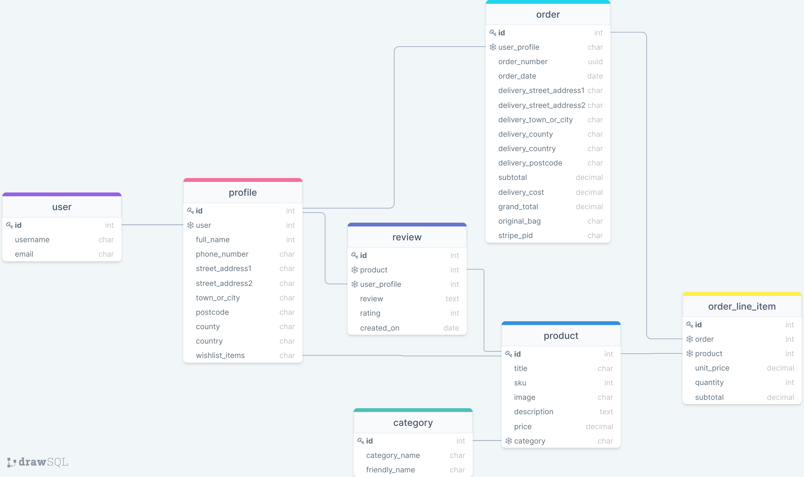

# **La Fraschetta**

[View the live site here]()

## **Contents**

[User Experience (UX)](#user-experience-ux)
* [User Stories](#user-stories)

[Design](#design)
* [Colour Scheme](#colour-scheme)
* [Typography](#typography)
* [Imagery](#imagery)
* [Wireframes](#wireframes)
* [Features](#features)
* [Future Features](#future-features)

[Information Architecture](#information-architecture)
* [Database Design](#database-design)

[Technologies Used](#technologies-used)
* [Languages Used](#languages-used)
* [Workspace](#workspace)
* [Version Control](#version-control)
* [Wireframing](#wireframing)
* [Responsive Design](#responsive-design)
* [Site Design](#site-design)
* [Database Design Technologies](#database-design-technologies)
* [Frameworks, Libraries and Others](#frameworks-libraries-and-others)
* [Testing](#testing)

[Deployment](#deployment)
* [Requirements for Deployment](#requirements-for-deployment)
* [Initial Deployment](#initial-deployment)
* [How to Fork it](#how-to-fork-it)
* [Making a Local Clone](#making-a-local-clone)

[Testing and Project Barrier Solutions](#testing-and-project-barrier-solutions)

[Credits](#credits)
* [Code](#code)
* [Content](#content)
* [Media](#media)
* [Acknowledgements](#acknowledgements)

---

## **User Experience (UX)**

### User Stories

#### Viewing and Navigation
* As a Shopper:
    * I wish to easily navigate the site so that I can have a good user experience.
    * I wish to get visual feedback so that I see when an action has been completed.
    * I wish to view all the products so that I can choose some to buy.
    * I wish to search for a specific product or category so that I may find the item that I want.
    * I wish to view full product information so that I can see the details of a specific product including the price, description, product rating and product image.
    * I wish to easily see my bag total so that I can stick to my budget.

#### Registration and User Accounts
* As a Site User:
    * I wish to create an account for future purchases so that I can view my order history and confirmations, and save my payment information.
    * I wish to easily login or logout so that I can access my profile and manage my personal details.
    * I wish to be able to request a password reset so that I can receive an email to reset my password incase I forget it.
    * I wish to get an email confirmation after registering so that I can verify my registration was successful.

#### Reviews and Wishlist
* As a Registered User:
    * I wish to be able to add my own reviews to products so that I may share my experience.
    * I wish to be able to edit/delete my reviews so that I can amend any errors or, in case I change my opinion.
    * I wish to be able to add products to my wishlist so that I can view those products later.
    * I wish to be able to remove products from my wishlist so that my wishlist only consists of products I want to have saved.

#### Sorting and Searching
* As a Shopper:
    * I wish to be able to sort the list of available products so that I can sort relevant products alphabetically, by name or by price.
    * I wish to be able to sort a category of products so that I can sort relevant products alphabetically, by name or by price.
    * I wish to be able to sort multiple categories simultaneously so that I can find the best rated or priced products across broad categories.
    * I wish to be able to search for a specific product by name or description so that I can quickly find items I'm interested in. 
    * I wish to be able to view a list of search results so that I can see if the product I want is available to purchase.
    * I wish to be able to easily see what I've searched for and the number of results so that I can quickly decide whether the product I'm looking for is available.

#### Purchasing and Checkout
* As a Shopper:
    * I wish to buy products online as a guest so that I can checkout without having to create an account.
    * I wish to easily add, update the quantity, or delete products in my bag so that I can adjust my purchase to fit my preferences before checkout.
    Easily enter my payment information	Have a smooth checkout experience
    * I wish to be able to easily enter my payment information so that I can have a smooth checkout experience.
    * I wish to experience that my payment and personal information are secure so that I can be confident enough to provide the neccessary information to purchase products securely.
    * I wish to view a summary of my order before completing my purchase so that I can check that I havn't made any mistakes.
    * I wish to receive a confirmation email of my purchase so that I can be confident that the purchase has been made successfully and view my order details.

#### Admin and Store Management
* As a Store Owner:
    * I wish to be able to add a new product so that I can add new products to my store.
    * I wish to be able to edit any product so that I can update the details of products.
    * I wish to be able to delete any product so that I can remove old items from my store.

[Back to Top](#la-fraschetta)

---

## **Design**

### Colour Scheme

* 

### Typography

* 

### Imagery

* 

### Wireframes
The wireframes for desktop, mobile and tablet for this project can be found below:
* [Home](documentation/wireframes/home.png)
* [Our Story](documentation/wireframes/our_story.png)
* [Contact Us](documentation/wireframes/contact.png)
* [Products and Categories](documentation/wireframes/products_and_categories.png)
* [Product and Reviews](documentation/wireframes/product_and_reviews.png)
* [Shopping Cart](documentation/wireframes/shopping_cart.png)
* [Checkout](documentation/wireframes/checkout.png)
* [Sign Up](documentation/wireframes/sign_up.png)
* [Log In](documentation/wireframes/login.png)
* [My Profile](documentation/wireframes/profile.png)
* [Wishlist](documentation/wireframes/wishlist.png)
* [Manage Products](documentation/wireframes/.png)

## Features

* 

---

### Future Features

* 

[Back to Top](#la-fraschetta)

---

## **Information Architecture**

### Navigation bar

### Database Design
The diagram below illustrates the database structure used in this project.

[Back to Top](#la-fraschetta)

---

## **Technologies Used**

### Languages Used

* [HTML5](https://developer.mozilla.org/en-US/docs/Web/Guide/HTML/HTML5)
* [CSS3](https://developer.mozilla.org/en-US/docs/Archive/CSS3#:~:text=CSS3%20is%20the%20latest%20evolution,flexible%20box%20or%20grid%20layouts.)
* [JavaScript](https://developer.mozilla.org/en-US/docs/Web/JavaScript)
* [Python](https://www.python.org/)

### Workspace

* [Gitpod](https://gitpod.io/) was used as a virtual IDE workspace to build this site.

### Version Control

* [Git](https://git-scm.com/) was used for version control by utilizing the Gitpod terminal to add and commit to Git and push to GitHub.
* [GitHub](https://github.com/) is used to store the code for this project after being pushed from Git.

### Wireframing

* [Balsamiq](https://balsamiq.com/) was used to create the wireframes during the design process.

### Responsive Design

* 

### Site Design

* 

### Database Design Technologies

* [drawSQL](https://drawsql.app/) was used to design the schema of the relational database.

### Frameworks, Libraries and Others

* 

### Testing

* 

[Back to Top](#la-fraschetta)

---

## **Deployment**

### Requirements for Deployment

* Python
* GitHub account
* Heroku account

### Initial Deployment

* 

### How to Fork it

1. Login or Sign Up to [GitHub](www.github.com).
2. On GitHub, go to [CarlaBuongiorno/la_fraschetta](https://github.com/CarlaBuongiorno/la_fraschetta).
3. In the top right, click "Fork".

### Making a Local Clone

1. Log in to [GitHub](https://www.github.com) and locate the [Repository](https://github.com/CarlaBuongiorno/la_fraschetta) for this site.
2. Under the repository name, above the list of files, click "Code".
3. Here you can either Clone or Download the repository.
4. You should clone the repository using HTTPS, clicking on the icon to copy the link.
5. Open Git Bash.
6. Change the current working directory to the new location, where you want the cloned directory to be.
7. Type `git clone`, and then paste the URL that was copied in Step 4.
    * `git clone https://github.com/CarlaBuongiorno/la_fraschetta.git`
8. Press Enter, and your local clone will be created.

Alternatively, if using Gitpod, you can click below to create your own workspace using this repository.

[Back to Top](#la-fraschetta)

---

## **Testing And Project Barrier Solutions**

All testing and project barriers and solutions has been documented here - [TESTING.md](https://github.com/CarlaBuongiorno/la_fraschetta/blob/master/TESTING.md)

[Back to Top](#la-fraschetta)

---

## **Credits**

### Code

* [Code Institute](https://codeinstitute.net/) was the main source of information used to create this project, specifically the Boutique Ado Mini Project Walkthrough by Chris Zielinski.
* [Bootstrap](https://getbootstrap.com/) throughout the site, to create a beautiful, responsive site.

### Media

* 

### Acknowledgements

* 

[Back to Top](#la-fraschetta)