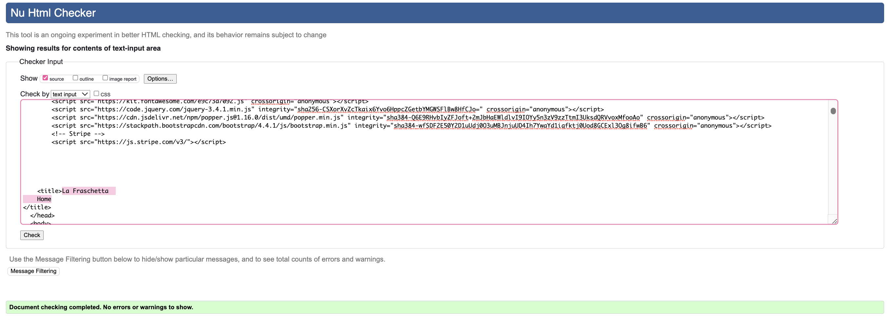
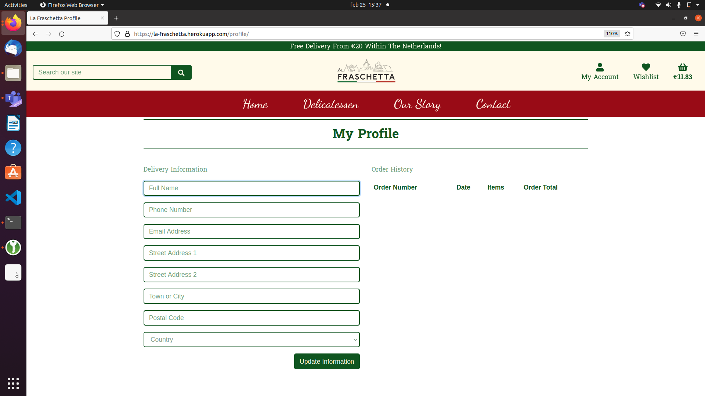
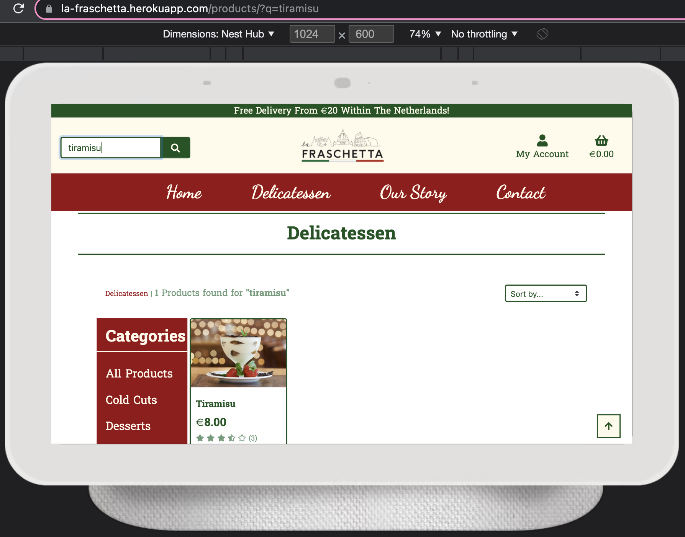

# **Testing And Project Barrier Solutions**

[Return to README.md](https://github.com/CarlaBuongiorno/la_fraschetta/blob/master/README.md)

[View the live site here](https://la-fraschetta.herokuapp.com/)

## **Contents**

[Testing User Stories](#testing-user-stories)

[Code Validation](#code-validation)

[Responsiveness And Compatibility](#responsiveness-and-compatibility)

[Testing Performance](#testing-performance)
* [Lighthouse](#lighthouse)

[Project Barriers and Solutions](#project-barriers-and-solutions)
* [Solved Bugs](#solved-bugs)
* [Known Bugs](#known-bugs)

---

## **Testing User Stories**

### Viewing and Navigation
* #### As a Shopper:
    * I wish to easily navigate the site so that I can have a good user experience.
        * The main navigation bar is easy to understand and is visible on every page of the site.
        * Clicking on a menu item in the navigation bar displays the relevant page without errors.
        * The __Account__ menu item is a dropdown that displays differently depending on what access the user has.
        * The logo at the top left of the page, takes the user back to the home page at any given point.
        * The __Delicatessen__ menu item is a dropdown displaying a list of all the categories a user can navigate to in order to find the relevant products in that category.
            * 
            * 
        * Scrolling down the _Home_ page, the list of categories are displayed and clicking into any of them will take the user to the _Products_ page displaying the relevant products in that category.
            * 
        * On the _Products_ page of a large screen, there is a side navigation menu displaying the list of categories where a user can navigate/filter through the products by means of their category groups. On a small screen this is displayed by means of a select-box.
            * 
        * On each page a user navigates to, there are buttons giving the user the option to navigate elsewhere, eg. back to the _Delcatessen_ (the _Products_ page), their _Profile_ page, the _Checkout_ page, etc.
            * 

    * I wish to get visual feedback so that I see when an action has been completed.
        * There are validation messages for all the forms if a user doesn't enter the correct format of information.
        * Toast messages are presented to the user in the form of:
            * Success messages
            * Error messages
            * Info messages (containing information for the user)
            * Warning messages

    * I wish to view all the products so that I can choose some to buy.
        * On the _Products_ page, all the products are displayed with one underneath the other on small screens, two in a row on md screens and four in a row on large screens.
            * 
        
    * I wish to search for a specific product or category so that I may find the item that I want.
        * There is a _search bar_ in the main navigation menu where a user can search for products or categories.
            * 
            * 
            (Two products are found for search term 'spaghetti'. The second product (Pecorino) contains the word 'spaghetti' in its description.)
    
    * I wish to view full product information so that I can see the details of a specific product including the price, description, product rating and product image.
        * Clicking on a product brings the user to the _Product Details_ page. Here it is clear what the product is by its image, it's name, the price, the category it belongs to, and the average ratings it has.
            * 

    * I wish to easily see my bag total so that I can stick to my budget.
        * Each time a product gets added to the cart, the total gets updated under the basket icon in the main navigation bar.
        * A success message also appears with a preview of the cart details.
            * 

---

### Registration and User Accounts
* #### As a Site User:
    * I wish to create an account for future purchases so that I can view my order history and confirmations, and save my payment information.
        * A user is able to register for an acount by clicking the 'Register' link in the _My Account_ dropdown in the main navigation menu.
            * 
        * A __Sign Up__ form is presented to the user to complete, and a message is displayed to inform the user they will receive an email and should click on the link from the email and then on the 'Confirm' email button to complete the verification process.
            * 
        * A user can then click on 'My Profile' under the 'My Account' menu dropdown and will be taken to their __Profile__ page. Here they have the ability to update their information as well as view their order history
            * 

    * I wish to easily login or logout so that I can access my profile and manage my personal details.
        * A user is able to login to their acount by clicking the 'Login' link in the _My Account_ dropdown in the main navigation menu.
            * 
        * A __Sign In__ form is be presented to the user to complete, and a success toast message will display once logged in.
            * 
        * A user is able to logout of their acount by clicking the 'Logout' link in the _My Account_ dropdown in the main navigation menu.
            * 
        * A __Sign Out__ confirmation button is be presented to the user, and a success toast message will display once signed out.
            * 

    * I wish to be able to request a password reset so that I can receive an email to reset my password incase I forget it.
        * On the __Sign In__ page, a user can click the 'Forgot Password?' link. This will take the user to a page where they have to enter their email. Upon receipt of an email, the user can follow the emailed link back to a page where they can enter a new password. They will then receive a message that the password change was successful.
            * 

---

### Reviews and Wishlist
* #### As a Registered User:
    * I wish to be able to add my own reviews to products so that I may share my experience.
        * If a user is registered and logged in, they will have acces to a _Review_ form on the _Product Detail_ page in order to add their own review to a product.
        * The newly added review will then be displayed on the _Product Detail_ page also with the date in which it was created.
            * 
            
    * I wish to be able to add products to my wishlist so that I can view those products later.
        * If a user is registered and logged in, they will have the ability to click on the wishlist heart displayed on the __Product Detail__ page.
        * The heart will turn red and immediately get added to the user's wislist.
        * The user's 'wished-for' items are displayed with image, description, and price on the __Wishlist__ page.
        * All the user's 'wished-for' items also get a little red heart on them on the __All Products__ page. 
            * 

    * I wish to be able to remove products from my wishlist so that my wishlist only consists of products I want to have saved.
        * To remove the product from the _Wishlist_ a user can either click on the red heart, which will make it turn back to green, or navigate to the __Wishlist__ page and remove by clicking on the trash can for that product.
            * 

---

### Sorting and Searching
* #### As a Shopper:
    * I wish to be able to sort the list of available products so that I can sort relevant products alphabetically, by name or by price.
        * A user has the ability to sort the products by _Price_, _Name_, _Category_, and _Ratings_.
            * 

    * I wish to be able to sort a category of products so that I can sort relevant products alphabetically, by name or by price.
        * A user has the ability to sort the products by _Price_, _Name_, and _Ratings_ within the sorted categories.
            * 

    * I wish to be able to search for a specific product by name or description so that I can quickly find items I'm interested in. 
        * There is a _search bar_ in the main navigation menu where a user can search for products or categories.
            * 
            
    * I wish to be able to view a list of search results so that I can see if the product I want is available to purchase.
        * After entering a search term, the user is presented with a list of relevant products.
            * 
            (Two products are found for search term 'spaghetti'. The second product (Pecorino) contains the word 'spaghetti' in its description.)

    * I wish to be able to easily see what I've searched for and the number of results so that I can quickly decide whether the product I'm looking for is available.
        * A user can easily see what they have searched for and how many products match the search term at top left side of the screen (under the page title) on large screens, and just under the page title on small screens.
            * 

---

### Purchasing and Checkout
* #### As a Shopper:
    * I wish to buy products online as a guest so that I can checkout without having to create an account.
        * A guest user has the ability to make purchases without having to sign up for an account.
            * 

    * I wish to easily add, update the quantity, or delete products in my bag so that I can adjust my purchase to fit my preferences before checkout.
        * On the __Product Detail__ page the user has the ability to add more than one of the same item to their bag.
        * Upon navigating to the __Shopping Cart__ page, a user has the ability to increase or decrease the quantity of a given item, as well as remove it entirely from the cart by means of the 'trash can' icon.
        * Any adjustments are followed my toast messages as visual feedback for the user and the cart's total is adjusted accordingly.
            * 

    * I wish to be able to easily enter my payment information so that I can have a smooth checkout experience.
        * Clicking the 'Secure Checkout' button takes the user to the __Checkout__ page where the user can fill out a form consisting of their delivery and payment details. All fields are labelled clearly for the user.
            * 

    * I wish to experience that my payment and personal information are secure so that I can be confident enough to provide the neccessary information to purchase products securely.
        * Stripe is used to handle all card payments on this site. Stripe is certified to PCI Service Provider Level 1, which is the most stringent level of certification available in the payments industry. All card numbers are encrypted with AES-256 (Advanced Encryption Standard - 256 bits), and decryption keys are stored on separate machines.

    * I wish to view a summary of my order before completing my purchase so that I can check that I havn't made any mistakes.
        * A summary of the user's order is displayed on the __Checkout__ page onder above the form on small screens and on the right side of the form on large screens.
            * 

    * I wish to receive a confirmation email of my purchase so that I can be confident that the purchase has been made successfully and view my order details.
        * After clicking the 'Complete Order' button, an email is sent to the user confirming their order and order number.
        * A message is displayed informing the user an email has been sent and a summary of the order is displayed on this page.
            * 

---

### Admin and Store Management
* #### As a Store Owner:
    * I wish to be able to add a new product so that I can add new products to my store.
        * A store owner has the additional ability to add products and categories to the site. 
        * The __Add Product__ and __Add Category__ forms can ba found by clicking the 'My Account' menu item in the navigation menu.
        * The forms are easy to understand and fill out and the added products and categories get stored in the database.
            * 

    * I wish to be able to edit any product so that I can update the details of products.
        * A store owner can edit any product by clicking on the 'Edit' link either on a product on the __All Products__ page, or on the __Product Detail__ page.
        * The user will be taken to the same form as the __Add Product__ form but will now have the existing product details filled in and can then update any detail.
            * 

    * I wish to be able to delete any product so that I can remove old items from my store.
        * A store owner can delete any product by clicking on the 'Delete' link either on a product on the __All Products__ page, or on the __Product Detail__ page.
        * 

[Back to Top](#testing-and-project-barrier-solutions)

---

## **Code Validation**

### W3C Markup Validation Service:
* The HTML for this site was validated by running each page through the [W3C HTML Markup Validator](https://validator.w3.org/) and returned no errors.
    * Home
        * 
    * Our Story
        * 
    * Products
        * 
    * Product Details
        * 
    * Profile
        * 
    * Wishlist
        * 
    * Shopping Cart
        * 
    * Checkout
        * 
    * Checkout Success
        * 

---

### W3C CSS Validation Service:
* The CSS for this site was validated by running each page through the [W3C CSS Validator]() via direct input and returned no errors.
    * Home
        * 
    * Our Story
        * 
    * Products
        * 
    * Product Details
        * 
    * Profile
        * 
    * Wishlist
        * 
    * Shopping Cart
        * 
    * Checkout
        * 
    * Checkout Success
        * 
    * Add Category
        * 
    * Add Product
        * 
    * Edit Product
        * 

---

### JSHint:
* All javascript files were tested with [JSHint](https://jshint.com/) and returned no errors.
    * Product and Category Image
        * 
    * Bag
        * 
    * Country Fields Functionality
        * 
    * Quantity Input Field
        * 
    * Sort
        * 
    * Stripe Payments
        * 
            * Errors highlighted in 'stripe_elements.js' pertain to Stripe import.

---

### PEP8:
* All python files were tested with [PEP8 online](http://pep8online.com/) and returned no errors.
    * Some lines are too long and cannot be broken up, therefore `# noqa:` is used in order for Flake8 to ignore them.
        * 

* The python extention was also used to test Python for PEP8 compliance with it's built in linting.
    * Errors that related to files that were auto generated by Django were left untouched.
    * ./checkout/app.py - 'checkout.signals' imported but unused
        * The import is used to let Django know there is a signals module, listening for changes to automatically update the totals.
            * 

[Back to Top](#testing-and-project-barrier-solutions)

---

## **Responsiveness And Compatibility**

The website was tested through the following browsers:

### Google Chrome

* Home
    * 
* Products
    * 
* Product Details
    * 
* Added a Review
    * 
* Remove From Wishlist
    * 
* Add to Bag
    * 
* Checkout Success
    * 

### Mozilla Firefox

* Sign Up
    * 
* Verify Email
    * 
* Profile
    * 
* Products
    * 
* Shopping Cart
    * 
* Checkout Success
    *  

---

DevTools were used to test the site across a range of widths:

### Mobiles: 

* iPhone SE (375px)
    * Menu
        * 
    * Added to Wishlist
        * 
    * Wishlist
        * 
    * Profile
        * 
    * Profile Updated
        * 
    * Sort By Ratings Descending
        * 
    * Error 404
        *  
    
* Samsung Galaxy S20 Ultra (412px)
    * Signed Out
        * 
    * Add to Bag
        * 
    * Shopping Cart
        * 
    * Updated Quantity
        * 
    * Checkout
        * 

---

### Tablets:

* iPad Air (820px)
    * Sign Out
        * 
    * Our Story
        * 
    * Product Details
        * 
    * Wishlist
        * 
    * Checkout
        * 

---

### Large Screen Devices:

* Nest Hub (1024px)
    * Home Categories Signed In
        * 
    * Error 404
        * 
    * Search -> No Results
        * 
    * Search Tiramisu
        * 
    * Sort Condiments By Price Ascending
        * 

* Desktop screen (1400px)
    * Empty Shopping Cart
        * 
    * Edit Product
        * 
    * Updated Product
        * 
    * Profile
        * 
    * Past Confirmation Order
        * 

---

The site was tested on the following physical devices:

### Mobiles: 

* Huawei P30
    * Sign In
        * 
    * Our Story
        * 
    * Profile
        * 
    * Profile Updated
        * 
    * Wishlist
        * 
    * Removed From Wishlist
        * 
    * Shopping Cart
        *  
    * Update Product Quantity
        *  
    * Loading
        *  
    * Checkout Success
        *  

---

### Laptops:

* MacBook Pro 13inch
    * Home
        * 
    * Products
        * 
    * Product Details
        * 
    * Added a Review
        * 
    * Remove From Wishlist
        * 
    * Add to Bag
        * 
    * Checkout Success
        * 

* Dell Windows X11 (Ubuntu 20.04.3 LTS)
    * Sign Up
        * 
    * Verify Email
        * 
    * Profile
        * 
    * Products
        * 
    * Shopping Cart
        * 
    * Checkout Success
        * 

[Back to Top](#testing-and-project-barrier-solutions)

---

## **Testing Performance**

### Lighthouse

* Google Lighthouse was run on different pages returning different results. Below is an extract of the reports for the 'Home' page, 'Product Details' page and 'Shopping Cart' page:
    * Home
        * 
    * Product Details
        * 
    * Shopping Cart
        * 

[Back to Top](#testing-and-project-barrier-solutions)

---

## **Project Barriers and Solutions**

### Solved Bugs

1. The 'My Account' dropdown menu was not working. To fix this I Changed the Bootstrap version to Bootstrap4 instead of Bootstrap5 and added jquery to the head in base.html.

2. When trying to render the products in the products.html template, they would not render. Instead I would get a 404 Page Not Found error.

The issue was that the `products/` path for the products app was inside the products app urls instead of the project level urls.

3. Search and filter categories would only work for a single word category eg: 'dolci', but not for 2 word category eg: `pasta_risotto`. It appeared correctly in the url `pasta,risotto`, but returned no products.

To fix this, I added a comma in the html to separate the words instead of the actual backend name => `pasta,risotto` instead of `pasta_risotto`.

4. The 'Categories' list disappeared from main nav dropdown menu while on home page. It seemed I couldn't access the product views from the project level template html file.
The solution was a Context Processor. I had to separate the categories list from the products view and put it into a _contexts.py_ file to make it available site wide in order for the dropdown categories in the main menu to access the category list.

5. The logo would disappear while on the Products page. The problem was that `<src>` was missing a '/' --> `src="media/logo.png"` instead of `src="/media/logo.png"`.

6. When making a payment at checkout, an error would occur on the card field "Received unknown parameter: payment_method_data[shipping]"

A closer look at the `payment_method` object in the 'stripe_elements.js' file showed that there was a closing bracket missing on the `billing_method` and the `shipping_method` was over-indented. Fixing these to things resolved the issue.

7. The Stripe Card Element was disappeared on the Checkout form. The issue was again in the 'stripe_elements.js' file. There was a comma missing from the `payment_method` object.

8. Some of the toast messages were falling off the page.

To fix this I had to set a `min-width` css property to the `.message-container` class in order to force its position. 

9. Stripe 'payment_intent.success' was failing with a server 500 error.

The problem was in the 'webhook_handler.py' file. In the `handle_payment_intent_succeeded` function, while attempting to get the order objects, I had `grand_total__iexact=grand_total,`.

Using `__iexact` on an integer means you're calling upper() on a float, which will result in an error.
Changing this to just `grand_total=grand_total`, the error went away and payments were successful.

### Known Bugs

* There are no known bugs that I am aware of.

[Back to Top](#testing-and-project-barrier-solutions)